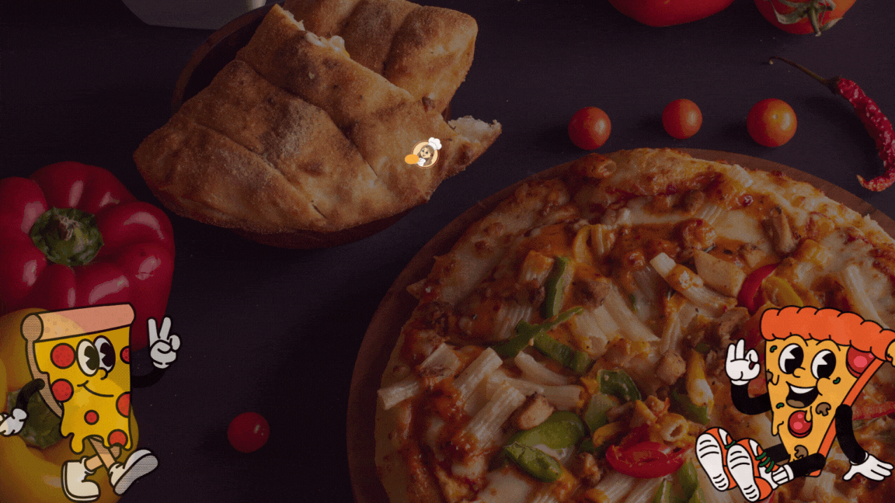

# 🍕 Pizza Sales SQL Analysis Project

This project is a complete **SQL data analysis case study** based on a pizza sales dataset. It was completed by following a YouTube tutorial and involves solving various business questions using SQL. The dataset was provided in CSV format and imported into a MySQL database for analysis.

---

##  Project Overview

In this project, I performed SQL-based analysis on a pizza sales dataset to answer real-world business questions related to revenue, popularity, timing, and pizza categories. 

Each SQL query solution is documented with a **screenshot** of the result, compiled in a **Canva presentation** (PDF format).

---

##  Dataset

- The dataset was provided in **CSV format** with the following files:
  - `orders.csv`
  - `order_details.csv`
  - `pizzas.csv`
  - `pizza_types.csv`

---

##  Tech Stack

- **MySQL**
- **MySQL Workbench**
- **Canva** (for the final presentation with screenshots)

---

##   Questions Solved

###  Basic Level

-  Retrieve the total number of orders placed  
-  Calculate the total revenue generated from pizza sales  
-  Identify the highest-priced pizza  
-  Identify the most commonly ordered pizza size  
-  List the top 5 most popular pizza types, along with their corresponding quantities  

###  Intermediate Level

-  Join the necessary tables to find the total quantity of each pizza category ordered  
-  Determine the distribution of orders by hour of the day  
-  Join relevant tables to find the category-wise distribution of pizzas  
-  Group the orders by date and calculate the average number of pizzas ordered per day  
-  Determine the top 3 most ordered pizza types based on revenue  

---

##  Documentation

You can view the full Canva presentation (with SQL query screenshots and results) here:

👉 [Pizza SQL Project Presentation (PDF)](./pizza_sql_project_canva_presentation-compressed.pdf)

---

##  Folder Structure
.
├── pizza-sales-sql-analysis/
│ ├── data/
│ │ ├── orders.csv
│ │ ├── order_details.csv
│ │ ├── pizzas.csv
│ │ └── pizza_types.csv
│ ├── pizza_sales_queries.sql
│ ├── pizza_sql_project_canva_presentation.pdf
│ ├── README.md

---

##  What I Learned

- How to import CSV files into MySQL
- Writing and optimizing SQL queries using `JOIN`, `GROUP BY`, `ORDER BY`, and aggregation functions
- Real-world business data analysis using SQL
- Organizing SQL results into a visual presentation

---

##  Credits

- Project inspired by a YouTube tutorial: **[WsCube Tech](https://youtu.be/zZpMvAedh_E?si=vaYBlt6GlvHZB_rd)**

- Dataset and problem set provided by the tutorial creator

---

##  How to Use

1. Clone the repository
2. Import CSV files into your MySQL database
3. Run the queries from `pizza_sales_queries.sql`
4. Open the PDF presentation to view the documented results

---

## ⭐ Feedback

If you found this project helpful or interesting, feel free to star the repository or leave feedback!

📌 **Note**: This project assumes that the dataset is based on sales from a fictional **Pizza Hut** branch. The brand is used solely for educational and analytical purposes.
